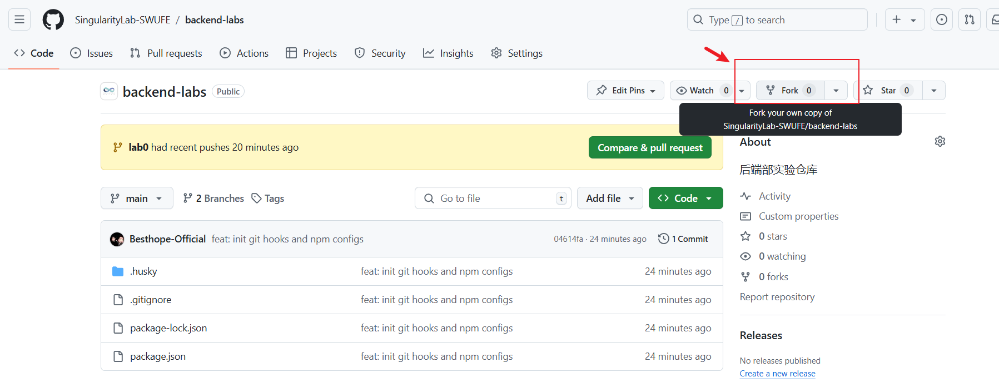
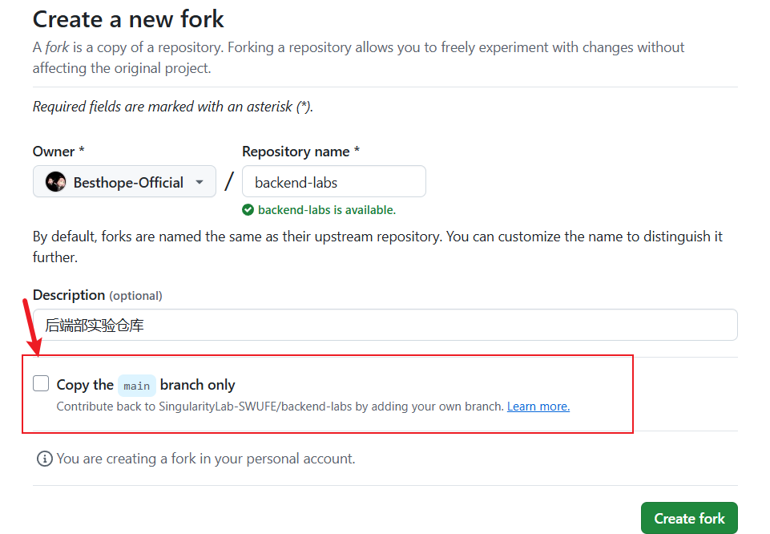
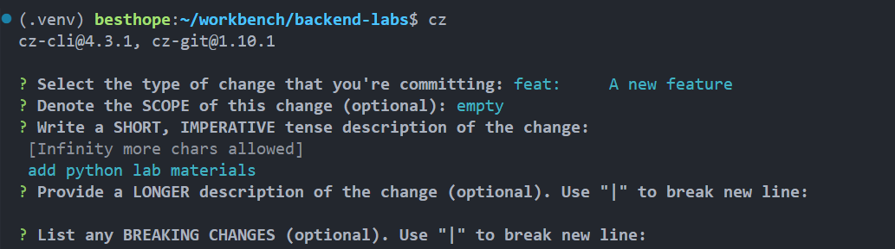

# 实验0: Hajime to git

## 实验目标

- 了解 Git 的基础操作
- 利用 git-cz 工具自动生成符合规范的 commit message
- 熟悉 python 的基础语法

## 实验内容

### fork 实验仓库

进入实验[仓库](https://github.com/SingularityLab-SWUFE/backend-labs), 点击右上角的 `Fork` 按钮



注意: fork 里将"只复制主分支"的选项关闭



之后使用 `git clone` 命令克隆你 fork 的仓库到本地.

### 配置

检查你的电脑上有无安装 Node.js 环境

```bash
node -v
```

全局安装 `commitizen`

```bash
npm install -g commitizen
```

在项目根目录安装好 `husky` 和 `cz-git` 插件

```bash
npm install
```

激活 husky 钩子

```bash
npm run prepare
```

### 任务 1: 编写 `lab.py`

`lab0` 目录下存放着你的实验代码和一个单元测试文件.

你需要完成对 `lab.py` 中三个函数的编写:

- `middle` 返回三个数中第二大的数
- `sum_digits` 返回各数位之和
- `double_eights` 判断一个数是否包含 2 个连续的 8

最后, 使用 `pytest` 对你的代码进行测试:

```bash
pip install pytest
```

```bash
pytest
```


### 任务 2: Git 操作

在 `lab0` 分支的基础上新建一个 `lab0-dev` 分支.

你需要在 `lab0-dev` 分支下, 使用 `git cz` 对 `lab.py` 的修改发起两次 commit:

- 对 `middle` 函数的修改, 提交类型为 `fix`
- 对 `sum_digits` 和 `double_eights` 的实现, 提交类型为 `feat`

下一步将 `lab0-dev` 分支推送到你 fork 的远程仓库中.

然后将 `lab0-dev` 分支合并到 `lab0` 分支下.

最后用 `git push --no-verify` 更新合并后的远程仓库.

完成任务之后, 在源项目的 Pull Request 中发起一条合并请求.

## Hint

### 拒绝提交

如果你的提交没有按照规则进行, 那么 git 会拒绝提交.

如果你的提交中不包含 `feat` 和 `fix`, git 会拒绝推送至远程仓库.

`--no-verify` 选项可以让你绕开 git hook

### 分块提交

```bash
git add -p lab0/lab.py
```

- `y` 和 `n` 表示是否将当前分块(hunk)置于暂存区
- `s` 选项表示对当前分块继续分块

### cz-git

在安装好 `commitizen` 和 `cz-git` 之后, 你可以用 `cz` 或 `git cz` 进入提交的 CLI 界面.

```bash
cz
```



### 分支操作

`git checkout` 有些过时, 我们推荐使用 `git switch` 来切换分支.

```bash
git switch --create lab0-dev
```

合并操作

```bash
git switch lab0
git merge lab0-dev -m '<commit message>'
```
